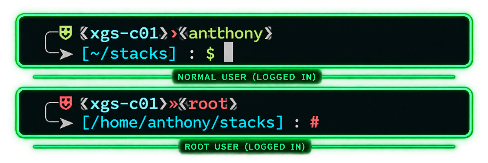

# Bash Prompt Installer

A safe, repeatable installer for a colorful two-line Bash prompt on Ubuntu and Debian systems.

It installs a shared prompt definition, enables it for interactive Bash shells, backs up files before they are changed, and can be run again without endlessly adding duplicate configuration blocks.

## Preview



### Standard user

```text
╭─⛨ ❮server-01❯›❮admin❯
╰─➤ [.../project/current-directory] : $
```

### Root user

```text
╭─⛨ ❮server-01❯»❮root❯
╰─➤ [.../etc/nginx/sites-enabled] : #
```

## Features

- Clear visual distinction between standard-user and root shells
- Displays hostname, current user, working path, and prompt symbol
- Uses a two-line layout to keep commands readable
- Shows the last four path components for long working directories
- Installs a shared prompt definition for interactive shells
- Creates timestamped backups before modifying configuration files
- Idempotent behavior: rerunning the installer does not duplicate its managed loader blocks
- Designed for Ubuntu and Debian systems using Bash

## Requirements

- Ubuntu or Debian
- Bash
- `sudo` or root access
- A UTF-8 terminal font that supports the prompt glyphs

## Install

### Download and change folder
```
git clone https://github.com/xgshost/bash-prompt-installer.git && cd bash-prompt-installer && sudo bash install-bash-prompt.sh
```
### Run the installer

```bash
sudo bash install-bash-prompt.sh
```

      > **Warning:** Review scripts before running them with `sudo`. Administrator privileges allow a script to read, modify, or delete system files and configuration. Make sure you understand and trust what the script does before executing it.

      ```bash
      nano install-bash-prompt.sh
      ```

### Start a new Bash session

```bash
exec bash
```

To check the root prompt, open a root login shell:

```bash
sudo -i
```

## What the installer changes

Depending on the system and the account used to run it, the installer may create or update these files:

```text
/etc/profile.d/xgs-prompt.sh
/etc/bash.bashrc
/root/.bashrc
/home/YOUR-USER/.bashrc
```

Before changing an existing file, the installer creates timestamped backups under:

```text
/root/bash-prompt-backups/
```

## Security warning

> **Review scripts before running them with `sudo`.** Administrator privileges allow a script to read, modify, or delete system files and configuration. Download the script from this repository, inspect its contents, and make sure you understand and trust what it does before executing it.

Do not run a command copied from an issue, fork, chat message, or third-party website as root unless you have reviewed it and verified the source.

For extra assurance, clone the repository and inspect the exact files before running the installer:

```bash
git clone [https://github.com/xgshost/bash-prompt-installer.git](https://github.com/xgshost/bash-prompt-installer.git)
cd bash-prompt-installer
less install-bash-prompt.sh
bash -n install-bash-prompt.sh
sudo bash install-bash-prompt.sh
```

## Uninstall

The installer preserves backups, so the safest removal method is to restore the relevant configuration files from `/root/bash-prompt-backups/` and remove the prompt definition file:

```bash
sudo rm -f /etc/profile.d/xgs-prompt.sh
```

Then remove the installer-managed loader blocks from the affected Bash configuration files, or restore the timestamped backups created before installation.

Open a new shell after making changes:

```bash
exec bash
```

## Contributing

Issues and pull requests are welcome.

Please do not add credentials, API tokens, private hostnames, IP addresses, personal information, or other sensitive environment-specific details to issues, commits, or pull requests.

## License

This project is licensed under the MIT License. See [LICENSE](LICENSE) for details.
